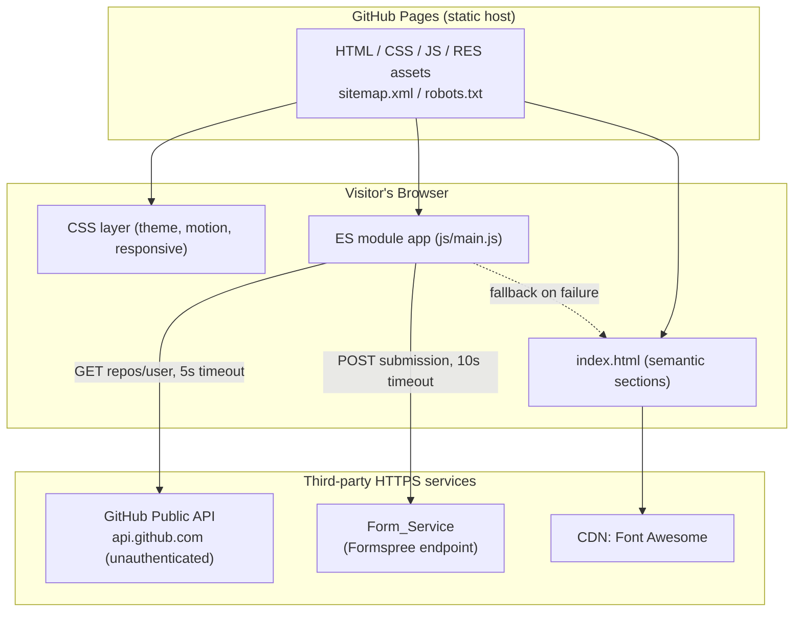
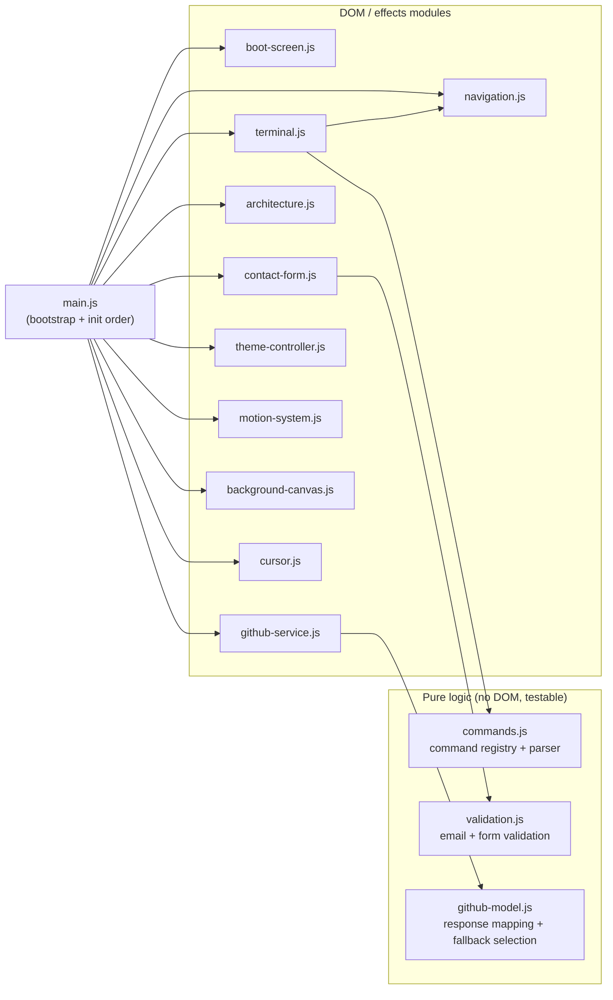

# Design Document

## Overview

This design evolves the existing single-page DevOps portfolio at `D:\Python\portfolio\ritooraj\` into a polished, production-quality site while treating the current codebase as the foundation. The current site already ships a terminal-boot loading screen, split-screen hero, JSON-styled about block, skills, filterable projects, HTML/icon architecture diagrams, an experience timeline, certifications, a (currently decorative) terminal, dark/light theming, a custom cursor, a canvas particle background, and scroll-driven animations.

The enhancement introduces:

- A **Signature Interface** — a cohesive "bootable-OS / live infrastructure dashboard" metaphor where the interactive terminal becomes a real navigation tool.
- **Live GitHub data** replacing hardcoded statistics, with resilient timeout and fallback behaviour.
- **Interactive, animated architecture diagrams** as a centerpiece, rebuilt on SVG for hover/focus highlighting and reduced-motion support.
- A **functional contact form** backed by a third-party form service, with client-side validation, timeout handling, and an email fallback.
- Systematic improvements to **performance, SEO, accessibility, responsiveness, cross-browser support, and motion coordination**.
- A fix for the **résumé filename bug** (the markup references `RES/Rituraj_Devops.pdf` but the actual file is `RES/Rituraj_devops (8).pdf`).

### Tech Stack Decision: Vanilla HTML/CSS/JS, Buildless (Recommended)

**Decision: Stay with vanilla HTML, CSS, and JavaScript with no build step.** The site will be organized into native ES modules (`<script type="module">`) and multiple CSS files, all served directly by GitHub Pages.

**Rationale:**

1. **Deployment stays trivial.** GitHub Pages serves static files as-is. A build step (Vite, webpack, etc.) would add a compile/publish pipeline, a `dist/` output, and a CI action — friction that provides no benefit for a site of this size. Requirement 16 mandates static-only assets with no server runtime; buildless is the most direct fit.
2. **Native ES modules are universally supported.** All Supported_Browsers (latest two versions of Chrome, Firefox, Safari, Edge) support `<script type="module">`, dynamic `import()`, `fetch`, `AbortController`, `IntersectionObserver`, and CSS custom properties. No transpilation is required.
3. **Matches the growth path.** The owner is progressing from beginner to advanced. Plain modules keep the code readable and debuggable directly in the browser devtools with no source maps or tooling layer.
4. **Relative paths just work.** Because the repo publishes at the domain root (`ritooraj01.github.io`), relative paths like `./js/main.js` and `RES/...` resolve correctly (Requirement 16.2).

**What changes without a build step:**

- The monolithic `script.js` (~950 lines) is split into small ES modules under `js/`, loaded via one module entry point. Modules give us clean seams for the few pure functions we will property-test.
- `style.css` (~2350 lines) is split into logical files combined with a single `styles.css` that uses `@import`, or via multiple `<link>` tags in `index.html`. We prefer multiple `<link>` tags to avoid the render-blocking waterfall that `@import` can introduce.
- Third-party libraries (Font Awesome, the form service SDK if used, and a property-testing library used only in local dev) load over HTTPS from a CDN (Requirement 16.3), never bundled.

**When a light build *would* be justified (not now):** if the project later adds a component framework, TypeScript, or dozens of pages, a light setup like Vite would pay for itself. At the current scope it does not.

### Alignment to Requirements

Every requirement (1–16) maps to one or more components described below. The design does not rewrite working code; it refactors `script.js` into modules, adds the missing GitHub/contact/terminal wiring, rebuilds the architecture diagram on SVG, and layers in SEO, accessibility, and reduced-motion handling.

## Architecture

### System Context

The Portfolio_Site is a fully client-side static application. At runtime the browser loads static assets from GitHub Pages and talks to two third-party HTTPS endpoints: the GitHub public API (read-only, unauthenticated) and the Form_Service (write-only form submission). No secrets are embedded in the delivered assets.



### Runtime Module Architecture

`js/main.js` is the single module entry point (`<script type="module" src="js/main.js">`). It imports feature modules and initializes them after `DOMContentLoaded`. Pure-logic modules (no DOM access) are separated from DOM/effect modules so they can be tested in isolation.



### Signature Interface Concept (Requirement 1)

The unifying metaphor is a **live infrastructure dashboard that boots like an operating system**. Concretely, this is expressed through shared design tokens and interaction patterns rather than per-section styling:

- **Boot then dashboard:** the Boot_Screen presents an OS-style boot log; once complete, the site reads as a running dashboard.
- **Consistent chrome:** every Section uses the same glassmorphism card surfaces, monospace terminal typography for headings/labels (each section title is a shell command such as `$ cat about.txt`), and the cyan `#00D9FF` / purple `#7B2FF7` / pink `#FF006E` accent palette (Requirement 1.2, 1.3).
- **The terminal is the control plane:** the Command_Terminal is promoted from decoration to a real navigation device (Requirement 2), reinforcing the "operate the system" metaphor.
- **Continuity during navigation:** navigation scrolls within one continuous document, so the metaphor never breaks between Sections (Requirement 1.4). Shared CSS custom properties guarantee visual continuity because all surfaces derive from the same tokens.

All of these are driven by CSS custom properties defined once in `:root` (and overridden under `[data-theme="light"]`), so the metaphor is enforced by shared tokens instead of duplicated styles.

## Visual Design Language (Signature Interface Tokens)

The visual system is derived primarily from an **editorial-dark developer-tool aesthetic** (Resend-inspired) and secondarily from a **color-cycling card idea** (Clay-inspired), adapted to the existing DevOps cyan/purple/pink identity. Two `DESIGN.md` reference files generated by `getdesign` live under `RES/design-refs/` (moved out of the site root so they are never deployed) and inform the tokens below; the tokens here — not those files — are the authoritative spec.

### Core aesthetic principles (adopted from the editorial-dark reference)

1. **Depth from hairlines, not shadows.** Surfaces register elevation through 1px translucent-white borders and luminance steps between background layers, not drop shadows. This replaces the current heavy `box-shadow` glows on cards.
2. **Accent-as-atmosphere.** The cyan `#00D9FF`, purple `#7B2FF7`, and pink `#FF006E` accents move from heavy solid fills/borders to **low-opacity radial glows** anchored at the top of each section (one glow per section, falling off to canvas within ~600px). Solid accent color is reserved for small, high-signal elements: the primary CTA, active states, status dots, links, and diagram-node categories.
3. **Code-window chrome everywhere it earns it.** The existing traffic-light code block (about section) becomes a reusable shell used for the terminal, code samples, and any "output" surface — reinforcing the OS metaphor.
4. **Type carries hierarchy, not weight.** A display face for hero/section openers, Inter for UI/body, and a monospace for code/labels. Section titles remain shell commands (`$ cat about.txt`).
5. **Status dots as a live-dashboard motif.** A green `status-dot` next to "Operational"-style labels ties the whole site to the "live infrastructure dashboard" idea and directly supports the GitHub/live-data panel.

### Design tokens (added to `css/variables.css`)

These extend — not replace — the existing palette. Existing accent variables are retained for backward compatibility during migration.

```
:root {
  /* Canvas & surface layers (dark theme) — luminance-stepped, no shadow reliance */
  --canvas:            #06070D;   /* deepest page background */
  --surface-1:         #0A0E1A;   /* existing bg-primary, card floor */
  --surface-2:         #10131F;   /* elevated card */
  --surface-3:         #151A28;   /* code/terminal well (existing bg-card) */

  /* Hairlines replace shadows */
  --hairline:          rgba(255,255,255,0.06);
  --hairline-strong:   rgba(255,255,255,0.12);
  --divider-soft:      rgba(255,255,255,0.04);

  /* Accents (retained identity) — used as solids only for small high-signal elements */
  --accent-cyan:       #00D9FF;
  --accent-purple:     #7B2FF7;
  --accent-pink:       #FF006E;
  --accent-green:      #00FFA3;   /* status / success / "operational" */
  --accent-amber:      #FFD60A;   /* warnings, highlight strokes */

  /* Atmospheric glow forms (low opacity, backgrounds only) */
  --glow-cyan:         rgba(0,217,255,0.16);
  --glow-purple:       rgba(123,47,247,0.18);
  --glow-pink:         rgba(255,0,110,0.14);
  --glow-green:        rgba(0,255,163,0.14);

  /* Text ramp */
  --ink:               #F5F8FF;   /* primary text, faintly cool */
  --text-body:         rgba(245,248,255,0.86);
  --text-muted:        rgba(245,248,255,0.60);

  /* Radius vocabulary (strict) */
  --r-xs: 4px; --r-sm: 6px; --r-md: 8px; --r-lg: 12px; --r-xl: 16px; --r-2xl: 24px; --r-full: 9999px;

  /* Spacing rhythm (4px base) */
  --sp-xs: 4px; --sp-sm: 8px; --sp-md: 12px; --sp-lg: 16px; --sp-xl: 24px; --sp-2xl: 32px;
  --sp-section: 96px;

  /* Type families */
  --font-display: "Space Grotesk", "Inter", system-ui, sans-serif;  /* hero + section openers */
  --font-ui:      "Inter", system-ui, -apple-system, sans-serif;    /* UI + body */
  --font-mono:    "JetBrains Mono", "Geist Mono", "Courier New", monospace; /* code + labels */
}
```

**Font strategy (buildless, Requirement 16.3):** load `Space Grotesk`, `Inter`, and `JetBrains Mono` from Google Fonts over HTTPS with `display=swap` and a `preconnect`. These are open-source and free — no licensing gap. If any font fails to load, the system-ui / Courier fallbacks keep the layout intact. This replaces the current reliance on `Inter/Segoe UI` and `Courier New` only.

### Radius & elevation mapping (applied across components)

| Element | Radius | Surface | Border |
| --- | --- | --- | --- |
| Buttons, inputs, tags | `--r-md` (8px) | per component | `--hairline-strong` |
| Feature/skill/project cards | `--r-xl` (16px) | `--surface-2` | `--hairline` (hover → `--hairline-strong`) |
| Code / terminal wells | `--r-lg` (12px) | `--surface-3` | `--hairline-strong` |
| Pills, status dots, avatars | `--r-full` | `--surface-2` | none |
| Section glow layer | n/a | radial `--glow-*` | none |

The existing cyan `box-shadow` elevations are removed in favor of hairline borders plus, where a hover lift is wanted, a single subtle shadow token `--lift: 0 8px 32px rgba(0,0,0,0.35)` (neutral, not colored).

### Color-cycling for diagrams and categories (adapted from the Clay reference)

To make the architecture diagrams and skill categories read as distinct at a glance, node/category families cycle through the accent set in a fixed order — **cyan → purple → green → pink → amber** — never repeating the same accent twice adjacently. In the SVG architecture diagrams this colors each pipeline stage/infrastructure layer; in the skills grid it tints each category's icon and hairline. The cycle is defined once as an ordered token list so it stays consistent everywhere.

### Light theme

The light theme keeps the same structure with an inverted ramp: an off-white `--canvas`, near-black `--ink`, hairlines become low-opacity black (`rgba(0,0,0,0.08/0.14)`), and glow opacities drop by ~40% so washes stay subtle on white. Both themes are tuned to meet the ≥4.5:1 contrast requirement (Requirement 8.5).

### What this changes in the existing code

- `variables.css` gains the tokens above; `components.css` swaps colored `box-shadow` for hairline borders + the neutral `--lift` on hover.
- Section wrappers gain a `::before` radial-glow layer (one accent per section), disabled under reduced motion is unnecessary since glows are static — but they are suppressed in the reduced-transparency/high-contrast path.
- The hero headline adopts `--font-display`; code/terminal/labels adopt `--font-mono`; everything else uses `--font-ui`.
- Status-dot + "Operational" motif is added to the hero/GitHub panel to signal the live-dashboard concept.

These are visual-layer changes only; they do not alter the component interfaces, data models, or behaviors specified below.

## Components and Interfaces

### File / Module Organization

All implementation code lives only under `D:\Python\portfolio\ritooraj\`. Proposed structure (buildless):

```
portfolio/ritooraj/
  index.html                # semantic sections + SEO/OG meta + module script tag
  sitemap.xml               # NEW (Requirement 11.4)
  robots.txt                # NEW (Requirement 11.4)
  css/
    variables.css           # :root tokens, palette, light-theme overrides
    base.css                # reset, typography, layout primitives, utilities
    components.css          # cards, buttons, terminal, forms, nav, diagrams
    sections.css            # per-section layout (hero, about, skills, ...)
    motion.css              # animations + prefers-reduced-motion overrides
    responsive.css          # media queries (1024 / 768 / 480 breakpoints)
  js/
    main.js                 # entry: import + init order, DOMContentLoaded
    config.js               # static config (username, featured repos, fallbacks, form endpoint)
    boot-screen.js          # Boot_Screen controller
    terminal.js             # Command_Terminal DOM controller
    commands.js             # PURE: command registry + parser (no DOM)
    validation.js           # PURE: email + contact form validation (no DOM)
    github-service.js       # GitHub_Data_Service: fetch + cache + timeout
    github-model.js         # PURE: response mapping + fallback selection (no DOM)
    architecture.js         # Architecture_Diagram interactions (SVG)
    contact-form.js         # Contact_Form controller
    theme-controller.js     # Theme_Controller
    motion-system.js        # scroll/entrance animations + reduced-motion gating
    navigation.js           # section scrolling, mobile menu, scroll-spy
    background-canvas.js     # particle canvas (feature-detected)
    cursor.js               # custom cursor (desktop only, feature-detected)
  RES/
    profile.png
    resume.pdf              # NORMALIZED résumé filename (see Resume section)
  README.md
```

Notes:
- The existing single `style.css` is split into the `css/` files above. During migration we keep the exact rules and only reorganize; the `prefers-reduced-motion` block in `motion.css` is the one net-new area.
- The existing `script.js` is decomposed into the `js/` modules above. Existing behaviours (theme, filters, counters, canvas, boot) are preserved and moved; new behaviours (live GitHub, functional terminal, functional contact form, SVG diagrams) are added.

### Boot_Screen (Requirement 3)

**Responsibility:** play the terminal boot sequence, then reveal the main content, with a hard timeout and a reduced-motion fast path.

Interface (`boot-screen.js`):

```
initBootScreen({ maxDurationMs = 8000, reducedMotion: boolean }) : void
```

Behaviour:
- On load, disable page scroll and show the boot log (Requirement 3.1). The existing sequential `data-delay` line reveal and progress-bar fill are retained.
- On sequence completion, fade out and reveal content, re-enabling scroll (Requirement 3.2).
- A single guarded `hideBootScreen()` is called by whichever trigger fires first — normal completion, the 8s hard timeout, or the reduced-motion path — and it is idempotent so the screen is only hidden once (Requirement 3.3).
- When `prefers-reduced-motion: reduce` is set, skip the animated progression and reveal content within 1 second (Requirement 3.4).

### Command_Terminal (Requirement 2)

The existing terminal section is static markup and `script.js` references `#terminal-input` / `#terminal-output` elements that do not exist. This design adds those elements and wires them through a pure command layer.

**`commands.js` (PURE — no DOM):** the command registry and parser. This is the primary property-tested unit.

```
// A command definition
Command = {
  name: string,              // e.g. "help", "about", "projects", "clear"
  type: "navigate" | "output" | "clear" | "help",
  section?: string,          // for navigate commands, the target section id
  describe: string,          // one-line help text
  output?: string            // static output for "output" commands
}

COMMAND_REGISTRY : Record<string, Command>

normalizeInput(raw: string) : string
// trims and lowercases; collapses internal whitespace

parseCommand(raw: string, registry = COMMAND_REGISTRY) : CommandResult
// CommandResult =
//   { status: "ok", command: Command }
//   | { status: "empty" }
//   | { status: "unknown", name: string, hint: "Type 'help' for available commands." }

listCommands(registry = COMMAND_REGISTRY) : Command[]   // for `help`
```

**`terminal.js` (DOM controller):** owns the input/output DOM, calls `parseCommand`, and renders results:
- `help` → renders `listCommands()` output (Requirement 2.1).
- `navigate` (a command naming an existing Section) → calls `navigation.scrollToSection(section)` (Requirement 2.2). Navigation commands are generated from the actual section ids so the registry cannot drift from the DOM.
- `unknown` → renders an error naming the unrecognized command and pointing to `help` (Requirement 2.3).
- `clear` → empties the output area (Requirement 2.4).
- Every submitted command is echoed with its output appended in submission order (Requirement 2.5).
- The text input is a standard `<input>`, operable at ≤768px via the on-screen keyboard (Requirement 2.6).

The registry corrects the stale content currently in `script.js` (e.g. "GeeksforGeeks", `linkedin.com/in/rituraj-singh`) to match the canonical contact data in Requirement 15.3.

### GitHub_Data_Service (Requirement 4)

**`github-service.js` (effects):** fetches live public data for `ritooraj01`.

```
loadGitHubData() : Promise<GitHubViewModel>
// - reads sessionStorage cache first (TTL ~15 min) to respect the 60 req/hr
//   unauthenticated rate limit and speed up repeat visits
// - otherwise GET https://api.github.com/users/ritooraj01
//   and GET https://api.github.com/users/ritooraj01/repos?per_page=100
// - each request uses AbortController with a 5000 ms timeout
// - on any failure/timeout, resolves with FALLBACK_STATS (never rejects)
```

**`github-model.js` (PURE — no DOM):** maps raw API JSON to the view model and selects featured repos, independent of network.

```
mapUserStats(rawUser: object) : { publicRepoCount: number, primaryLanguage: string | null }
selectFeaturedRepos(rawRepos: object[], featuredNames: string[]) : RepoCard[]
// returns cards in the order of featuredNames; names with no match fall back
// to a static definition so all five featured repos always render
resolveStats(result: {ok: boolean, user?, repos?}, fallback: GitHubViewModel) : GitHubViewModel
// returns live data when ok, otherwise the fallback — total function, never throws
```

Behaviour:
- On projects Section load, request profile statistics (Requirement 4.1) and render public repo count and primary language on success (Requirement 4.2).
- On failure or >5s, render `FALLBACK_STATS` and show the Section without any error surfaced to the Visitor (Requirement 4.3).
- Always display the five featured repositories `alb-observability-automation`, `rabbitmq-production-monitoring`, `multi-vpc-cloudwatch-centralized-monitoring`, `AWS-Cloud-Cost`, `assistant-ai` (Requirement 4.4), using live metadata when available and static definitions otherwise.
- Only unauthenticated public requests; no token or secret in any asset (Requirement 4.5).

### Architecture_Diagram (Requirement 5)

**Decision: rebuild the diagrams as inline SVG.** The current diagrams are `div`+icon rows animated by a JS `setInterval`. SVG is a better fit for an interactive centerpiece: nodes are focusable/hoverable elements, and flow can be animated declaratively with CSS `stroke-dashoffset` on edge paths, which is trivially disabled under reduced-motion.

**`architecture.js` (effects):**
- Renders at least one CI/CD pipeline diagram and at least one cloud infrastructure diagram (Requirement 5.1). The existing three diagrams (CI/CD, GitOps, cloud layers) are preserved as SVG.
- Each node is a `<g>` with `tabindex="0"`, `role="img"`, and an accessible label; pointer hover and keyboard focus both apply the highlight class (Requirement 5.2, and keyboard focus supports Requirement 12).
- Flow animation runs only while the diagram is in the viewport, driven by an `IntersectionObserver` toggling a CSS class that animates edge `stroke-dashoffset` (Requirement 5.3).
- Under `prefers-reduced-motion: reduce`, edges render in their final state with no flow animation (Requirement 5.4); this is enforced in `motion.css`, so it holds even if JS is disabled.

### Contact_Form (Requirement 6)

**Decision: use Formspree as the Form_Service.** A Formspree form endpoint (`https://formspree.io/f/{formId}`) is safe to expose in static assets — it is a public submission URL, not a secret credential. (EmailJS is a viable alternative but requires a public key plus service/template IDs and an SDK; Formspree needs only a POST to the endpoint, which keeps the code buildless and secret-free.)

**`validation.js` (PURE — no DOM):**

```
isValidEmail(value: string) : boolean          // syntactic RFC-pragmatic check
validateContactForm({ name, email, message }) : ValidationResult
// ValidationResult = { valid: boolean, errors: { name?: string, email?: string, message?: string } }
// name non-empty (after trim), email syntactically valid, message non-empty (after trim)
```

**`contact-form.js` (effects):**
- Provides name, email, message fields (Requirement 6.1) — already present in markup.
- On submit, runs `validateContactForm`. If invalid, displays a message identifying each invalid field and does **not** POST (Requirement 6.3).
- If valid, POSTs JSON to the Formspree endpoint via `fetch` with an `AbortController` 10s timeout, and shows no validation message (Requirement 6.2).
- On confirmed success, shows a success confirmation (Requirement 6.4).
- On error or >10s, shows a failure message offering the direct address `singh.ritooraj@gmail.com` (Requirement 6.5). The existing `mailto:` flow becomes this fallback path.
- No secret credential embedded (Requirement 6.6).

### Resume Access (Requirement 7)

**Bug:** `index.html` links `RES/Rituraj_Devops.pdf`, but the file on disk is `RES/Rituraj_devops (8).pdf`. On the case-sensitive Linux filesystem behind GitHub Pages this 404s.

**Decision: normalize the asset filename and the reference.** Rename the file to `RES/resume.pdf` (no spaces, no parentheses, no case ambiguity) and update the download control to point at `RES/resume.pdf` with a friendly `download="Rituraj_Singh_Resume.pdf"` attribute (Requirement 7.1, 7.2, 7.3).

**Fallback (Requirement 7.4):** the download control also carries a JS-verified fallback. On click (or on load), `contact`/`main` performs a `HEAD`/`fetch` check of the primary path; if it does not resolve, it rewrites the link to the actual PDF present in `RES/` so the résumé stays retrievable even if the rename is missed. Because we control the rename, the primary path is expected to resolve; the fallback is defensive.

### Theme_Controller (Requirement 8)

**`theme-controller.js`:** retains the working localStorage logic from `script.js`.
- Toggle switches between dark and light (Requirement 8.1) and persists the choice to `localStorage["theme"]` (Requirement 8.2).
- On load, apply the persisted theme if present (Requirement 8.3), else default to dark (Requirement 8.4).
- To avoid a flash of the wrong theme, a tiny inline script in `<head>` sets `data-theme` before CSS paints; the module then wires the toggle.
- Both palettes are tuned so all text meets a ≥4.5:1 contrast ratio (Requirement 8.5); this is verified in the accessibility checklist.

### Motion_System (Requirement 13) and Reduced Motion

**`motion-system.js` + `motion.css`:** centralizes entrance animations, micro-interactions, and reduced-motion handling.
- Section entrance animations on scroll via `IntersectionObserver` (Requirement 13.1, 13.4).
- Hover/focus micro-interactions on controls always give feedback; under reduced motion the feedback uses non-motion cues (color/opacity/outline) rather than transforms (Requirement 13.2).
- Under `prefers-reduced-motion: reduce`, non-essential entrance and background animations are disabled and each Section renders in its final visible state (Requirement 13.3). `motion.css` implements a global reduced-motion block; JS reads `window.matchMedia('(prefers-reduced-motion: reduce)')` to skip JS-driven animation loops (boot progression, canvas, pipeline flow).

### Navigation, Responsive Layout, Cross-Browser (Requirements 2, 9, 10, 15)

**`navigation.js`:**
- Exposes `scrollToSection(id)` used by both nav links and the terminal.
- Smooth-scrolls to a Section when a nav control is activated (Requirement 15.4) and keeps the existing mobile bottom-nav scroll-spy.
- At ≤767px, the layout is single-column and navigation collapses into the hamburger menu (Requirement 9.1, 9.2); the split-screen hero applies at ≥768px (Requirement 9.4). Global `overflow-x` guards prevent horizontal scrolling at any width (Requirement 9.3).

**Cross-browser / graceful degradation (`background-canvas.js`, `cursor.js`):**
- The custom cursor and canvas background are feature-detected and desktop-gated; if unsupported or disabled, the underlying content still renders and the site stays navigable (Requirement 10.1, 10.2). The custom cursor never replaces the native cursor on touch/unsupported devices.

**Content Sections (Requirement 15):** the hero shows "Rituraj Singh" and "DevOps Engineer | Cloud Infrastructure | SRE" (15.1); all required sections are present (15.2); canonical contact links are `singh.ritooraj@gmail.com`, `github.com/ritooraj01`, `linkedin.com/in/rituraj-singh-0001` (15.3).

### SEO & Social Metadata (Requirement 11)

Added to `index.html` `<head>` and the site root:
- `<title>`, `<meta name="description">`, `<meta name="author">` (Requirement 11.1).
- Open Graph tags: `og:title`, `og:description`, `og:type`, `og:image`, `og:url` (Requirement 11.2). `og:image` uses an absolute HTTPS URL under the Pages domain.
- `<link rel="canonical" href="https://ritooraj01.github.io">` (Requirement 11.3).
- `sitemap.xml` and `robots.txt` at the site root (Requirement 11.4).

### Accessibility (Requirement 12)

- Every informational image has descriptive `alt`; decorative images use empty `alt` (Requirement 12.1).
- Every interactive control has an accessible name (`aria-label` or visible text), including the theme toggle, hamburger, terminal input, and SVG diagram nodes (Requirement 12.2).
- All controls are reachable and operable by keyboard, including the terminal and diagram nodes (Requirement 12.3).
- A visible focus indicator is defined globally via `:focus-visible` and is not removed (Requirement 12.4).
- `<html lang="en">` is set (Requirement 12.5) — already present.

### Performance (Requirement 14)

- Keep initial payload small: defer non-critical work to after first paint, load modules with `type="module"` (deferred by default), and avoid heavy synchronous work on the main thread so the site is interactive within 3s on broadband (Requirement 14.1).
- Below-the-fold images use native `loading="lazy"` (and the profile image above the fold does not) so they load as they approach the viewport (Requirement 14.2). The existing `IntersectionObserver` lazy path is kept as a fallback for very old engines.
- Animation loops use `requestAnimationFrame`, are paused off-screen, and are disabled under reduced motion, sustaining ≥30fps on desktop scroll (Requirement 14.3).

## Data Models

### Config (`js/config.js`)

```
CONFIG = {
  githubUsername: "ritooraj01",
  githubApiBase: "https://api.github.com",
  githubTimeoutMs: 5000,
  githubCacheTtlMs: 15 * 60 * 1000,
  featuredRepos: [
    "alb-observability-automation",
    "rabbitmq-production-monitoring",
    "multi-vpc-cloudwatch-centralized-monitoring",
    "AWS-Cloud-Cost",
    "assistant-ai"
  ],
  fallbackStats: {           // GitHubViewModel used on failure (Requirement 4.3)
    publicRepoCount: 12,
    primaryLanguage: "Python",
    live: false
  },
  formEndpoint: "https://formspree.io/f/{formId}",  // public, non-secret
  formTimeoutMs: 10000,
  contactEmail: "singh.ritooraj@gmail.com",
  resumePath: "RES/resume.pdf"
}
```

### Command Registry (`js/commands.js`)

```
Command = {
  name: string,
  type: "navigate" | "output" | "clear" | "help",
  section?: string,     // present iff type === "navigate"
  describe: string,
  output?: string       // present iff type === "output"
}

// Navigation commands are derived from actual section ids:
//   home, about, skills, projects, architecture, experience, certifications, contact
// Non-navigation commands: help, clear, whoami, and output commands (about/skills/contact text)

CommandResult =
  | { status: "ok", command: Command }
  | { status: "empty" }
  | { status: "unknown", name: string, hint: string }
```

### GitHub View Model (`js/github-model.js`)

```
GitHubViewModel = {
  publicRepoCount: number,
  primaryLanguage: string | null,
  live: boolean            // true when derived from a successful API response
}

RepoCard = {
  name: string,
  description: string,
  language: string | null,
  stars: number,
  url: string,
  featured: true
}

// Relevant GitHub API response fields consumed (unauthenticated):
// GET /users/{u}          -> { public_repos: number, login, ... }
// GET /users/{u}/repos    -> [{ name, description, language, stargazers_count, html_url }, ...]
// primaryLanguage is the most frequent non-null `language` across repos.
```

### Contact Submission (`js/validation.js`, `js/contact-form.js`)

```
ContactSubmission = { name: string, email: string, message: string }

ValidationResult = {
  valid: boolean,
  errors: { name?: string, email?: string, message?: string }
}
```

### Theme State (`js/theme-controller.js`)

```
Theme = "dark" | "light"
// Persisted at localStorage["theme"]; absence implies default "dark".
// Applied as the `data-theme` attribute on <html>.
```

## Correctness Properties

*A property is a characteristic or behavior that should hold true across all valid executions of a system — essentially, a formal statement about what the system should do. Properties serve as the bridge between human-readable specifications and machine-verifiable correctness guarantees.*

This site is mostly UI rendering, DOM interaction, third-party integration, timing, and static configuration — areas better served by example, edge-case, and smoke tests (see Testing Strategy). However, three modules are **pure functions** with genuinely universal behavior and are worth property-based testing: the command parser/registry (`commands.js`), the contact validator (`validation.js`), and the GitHub response model (`github-model.js`). The following properties target exactly those modules. All other acceptance criteria are covered by the example/edge/integration/smoke tests enumerated in the Testing Strategy.

### Property 1: Command parsing resolves known commands and rejects unknown ones

*For any* input string, `parseCommand`:
- returns `{ status: "empty" }` when the normalized input is empty; otherwise
- returns `{ status: "ok", command }` where `command` is the registry entry whose `name` equals the normalized input, if such an entry exists (and for a `navigate` command, `command.section` equals an existing section id); otherwise
- returns `{ status: "unknown", name, hint }` where `name` equals the normalized input and `hint` references the `help` command.

**Validates: Requirements 2.2, 2.3**

### Property 2: Help output covers exactly the registry

*For any* command registry, the output produced for the `help` command names every command present in the registry and names no command absent from it.

**Validates: Requirements 2.1**

### Property 3: Command history preserves submission order and pairing

*For any* finite sequence of submitted commands (excluding `clear`), the terminal's rendered entries appear in the same order the commands were submitted, and each submitted command is paired with its own resulting output.

**Validates: Requirements 2.5**

### Property 4: Contact validation is correct and complete

*For any* `{ name, email, message }` input, `validateContactForm` returns `valid === true` with no error keys **if and only if** `name` is non-empty after trimming, `email` is syntactically valid, and `message` is non-empty after trimming; and whenever `valid === false`, `errors` contains an entry for each field that fails its rule and no entry for any field that passes.

**Validates: Requirements 6.2, 6.3**

### Property 5: GitHub user-stats mapping is faithful

*For any* well-formed GitHub user payload and repository list, `mapUserStats` returns `publicRepoCount` equal to the payload's `public_repos` and `primaryLanguage` equal to the most frequently occurring non-null repository `language` (or `null` when no repository declares a language).

**Validates: Requirements 4.2**

### Property 6: Stats resolution is total and falls back safely

*For any* service result, `resolveStats` never throws and returns the live view model when the result is flagged successful, and returns the predefined fallback view model (with `live === false`) otherwise.

**Validates: Requirements 4.3**

### Property 7: Featured repositories are always fully represented

*For any* repository list returned by the API, `selectFeaturedRepos` produces exactly the five configured featured repositories, in the configured order, using live metadata where a matching repository exists and the static definition otherwise.

**Validates: Requirements 4.4**

## Error Handling

### GitHub API failure or timeout (Requirement 4.3)
- Each request is wrapped in an `AbortController` with a 5000 ms timeout. Network error, non-2xx status, JSON parse error, or abort all resolve (never reject) to the fallback path.
- `resolveStats` returns `CONFIG.fallbackStats`; the projects Section renders normally with no error surfaced to the Visitor.
- Rate limiting (HTTP 403 with `X-RateLimit-Remaining: 0`) is treated as a failure and uses the fallback. A short-lived `sessionStorage` cache reduces the chance of hitting the 60 req/hr unauthenticated limit.
- Featured repos always render because `selectFeaturedRepos` backfills from static definitions.

### Contact form failure or timeout (Requirement 6.5)
- Submission uses `fetch` with an `AbortController` 10000 ms timeout.
- On non-2xx, network error, or timeout, the form shows a failure message that includes the direct address `singh.ritooraj@gmail.com` and offers a `mailto:` link prefilled with the entered values, so the Visitor can still reach out.
- Validation failures short-circuit before any network call and display per-field messages (Requirement 6.3).

### Résumé path resolution (Requirement 7.4)
- Primary reference is the normalized `RES/resume.pdf`. A defensive check verifies the primary path resolves; if it does not, the control is rewritten to the actual PDF present in `RES/` so the résumé stays retrievable.

### Boot screen stall (Requirement 3.3)
- An 8s hard-timeout timer guarantees the boot screen hides even if the animated sequence stalls. The `hideBootScreen` routine is idempotent, so overlapping triggers (completion, timeout, reduced-motion path) hide the screen exactly once and always re-enable scrolling.

### Feature detection / graceful degradation (Requirement 10.2)
- Canvas and custom cursor are guarded by capability checks and desktop gating; failure to initialize them leaves content visible and the site navigable. Errors in optional effect modules are caught so one failing enhancement never blocks core content or navigation.

### Third-party asset (CDN/SDK) load failure
- Font Awesome icons degrade to absent glyphs without breaking layout; text labels accompany critical controls so meaning is not icon-dependent.

## Testing Strategy

This is a static, buildless site maintained by a solo developer, so the testing approach is deliberately lightweight and layered. It combines a **manual verification checklist** (the primary tool for UI, responsive, cross-browser, and performance criteria) with a **small set of automated property tests** for the three pure-logic modules.

### Layer 1 — Property tests for pure logic (automated)

The pure modules (`commands.js`, `validation.js`, `github-model.js`) import nothing from the DOM, so they can be tested in Node without a build step. Use a property-based testing library — **fast-check** — run via `npx` so nothing is added to the deployed site and no bundler is introduced:

```
npx fast-check   # invoked through a test runner such as `node --test` with fast-check
```

Requirements for these tests:
- Use fast-check (do not hand-roll generators or a PBT engine).
- Each property test runs a minimum of **100 iterations**.
- Each test is tagged with a comment referencing its design property, in the format:
  `// Feature: advanced-devops-portfolio, Property {number}: {property_text}`
- One property-based test implements each of Properties 1–7 above.
- Test files live under `portfolio/ritooraj/tests/` (e.g. `commands.test.mjs`, `validation.test.mjs`, `github-model.test.mjs`). They are dev-only and are excluded from deployment via `robots.txt`/not linked from `index.html`; they do not affect the static site.

These tests are the reason the pure logic is factored out of the DOM controllers.

### Layer 2 — Example, edge-case, and integration tests (automated where practical)

For DOM-facing behavior, a few focused example tests provide high value without heavy tooling. These can run against jsdom in Node or as small assertions in a `tests.html` page opened in a browser:
- **Terminal:** `clear` empties output (2.4); narrow-viewport input submits (2.6).
- **Boot screen:** completion hides + reveals (3.2); 8s hard timeout hides via fake timers (3.3); reduced-motion reveals ≤1s (3.4).
- **GitHub service:** correct URL requested on projects load with a mocked fetch (4.1); success renders count/language (4.2 end-to-end); failure/timeout renders fallback with no error (4.3 end-to-end).
- **Contact form:** valid submit POSTs and shows success with mocked 200 (6.4); error/timeout shows failure with fallback email via fake timers (6.5).
- **Theme:** toggle flips and persists (8.1, 8.2); persisted theme applied on load (8.3); default dark when unset (8.4).
- **Résumé fallback:** mocked 404 rewrites link to existing PDF (7.4).
- **Architecture diagram:** hover/focus applies highlight (5.2); intersection toggles flow class (5.3).
- **Cross-browser rendering (10.1)** and **performance TTI/fps (14.1, 14.3)** are integration/smoke checks — verified manually in each Supported_Browser and with a Lighthouse/devtools performance capture, not property tests.

### Layer 3 — Manual verification checklist (primary for UI/visual/responsive/a11y/SEO/deploy)

A `TESTING.md` checklist (dev-only) is run before each significant change. It covers the criteria that are visual, environmental, or one-time configuration:

- **Signature Interface (1.1, 1.3, 1.4):** sections share chrome; no discontinuity while navigating.
- **Palette (1.2):** confirm `--primary-color:#00D9FF`, `--secondary-color:#7B2FF7`, accent pink `#FF006E` in `variables.css`.
- **Diagrams (5.1, 5.4):** both a CI/CD and a cloud diagram present; reduced-motion shows final state with no flow animation.
- **Contact fields (6.1)** and **security scans (4.5, 6.6):** grep delivered assets for tokens/`Authorization` headers — confirm none; only the public Formspree endpoint appears.
- **Résumé (7.1, 7.2, 7.3):** control links to `RES/resume.pdf`; file exists; download works.
- **Contrast (8.5):** compute contrast for each text-on-background token pair in both themes; confirm ≥4.5:1 (browser devtools or a contrast checker).
- **Responsive (9.1, 9.2, 9.3, 9.4):** single-column + hamburger at ≤767px; split hero at ≥768px; no horizontal scroll (`documentElement.scrollWidth <= clientWidth`) across widths 320/375/768/1024/1440.
- **Degradation (10.2):** disable canvas/cursor — content stays visible and navigable.
- **SEO (11.1, 11.2, 11.3, 11.4):** title/description/author, OG tags, canonical, and `sitemap.xml`/`robots.txt` present and well-formed.
- **Accessibility (12.1–12.5):** alt text, accessible names, keyboard reachability, visible `:focus-visible` indicator, `<html lang>`; spot-check with a screen reader and keyboard-only navigation.
- **Motion (13.1–13.4):** entrance animations and micro-interactions on/off correctly under both reduced-motion states.
- **Performance (14.1, 14.2, 14.3):** Lighthouse TTI < 3s on broadband; below-fold ``; ≥30fps during desktop scroll in devtools.
- **Content (15.1–15.4):** hero name/role; all sections; correct contact links; nav scrolls to sections.
- **Deployment (16.1, 16.2, 16.3):** static-only; all local paths relative and resolving from the Pages root; all third-party URLs over HTTPS. Verify by serving locally (`npx serve portfolio/ritooraj`) and by loading the deployed Pages URL.

### Test-to-Requirement Coverage Summary

| Requirement area | Primary test layer |
| --- | --- |
| 2.1–2.3, 2.5 (command logic) | Property (P1–P3) |
| 4.2–4.4 (GitHub model) | Property (P5–P7) |
| 6.2–6.3 (validation) | Property (P4) |
| 2.4, 2.6, 3.x, 4.1, 5.x, 6.1/6.4/6.5, 7.x, 8.x, 10.2, 13.x | Example / edge-case |
| 1.x, 4.5, 6.6, 9.x, 11.x, 12.x, 15.x, 16.x | Manual checklist / smoke |
| 10.1, 14.1, 14.3 | Integration (browser / Lighthouse) |
